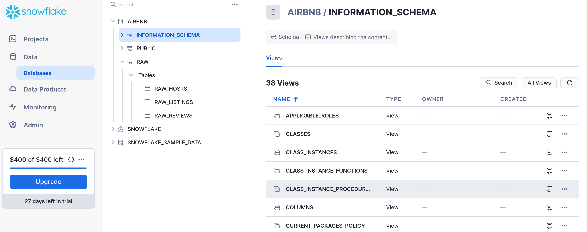

# Complete dbt Bootcamp Zero to hero (Udemy)
Project development related to [Udemy Course](https://www.udemy.com/course/complete-dbt-data-build-tool-bootcamp-zero-to-hero-learn-dbt) from Zoltan C. Toth and Miklos (Mike) Petridisz.

## Creating development environment with Poetry
First, make sure Poetry is installed.

```bash
curl -sSL https://install.python-poetry.org | python3 -
poetry --version
```

Next, change directory to your repository folder and initialize Poetry.
```bash
poetry init
```
Now you have Poetry taking care of your working environment and dependencies.

## Installing dbt and Snowflake connector
To install dbt and the Snowflake connector, you can simply run.
```bash
poetry add dbt-snowflake==1.7.1
```

And to create your working environment using Poetry, just run.
```bash
poetry shell
```

With the environment created and activated, just test if dbt was properly installed.
```
dbt --version
```

And you should get an output similar to this.

```bash
Core:
  - installed: 1.7.10
  - latest:    1.7.10 - Up to date!

Plugins:
  - snowflake: 1.7.1 - Update available!

  At least one plugin is out of date or incompatible with dbt-core.
  You can find instructions for upgrading here:
  https://docs.getdbt.com/docs/installation
  ```

## Creating your Snowflake account
Snowflake offers a 30 day free-trial account for you to test their Data Warehouse. As it integrates flawlessly with dbt, we are going to use as our DW in this project.

Go to [Snowflake webpage](https://www.snowflake.com) and click on "Start for free" on the top right blue buttom. Make sure to choose the following options:
- Snowflake edition: Standard
- Cloud provider: AWS
- AWS region: US East Ohio

You'll receive an email with the Snowflake account creation confirmation, make sure to accept it and access the platform.

## Importing data to Snowflake
After accessing Snowflake platform, open a new Worksheet (Project > Worksheets) and run the SQL command:
```sql
-- Use an admin role
USE ROLE ACCOUNTADMIN;

-- Create the `transform` role
CREATE ROLE IF NOT EXISTS transform;
GRANT ROLE TRANSFORM TO ROLE ACCOUNTADMIN;

-- Create the default warehouse if necessary
CREATE WAREHOUSE IF NOT EXISTS COMPUTE_WH;
GRANT OPERATE ON WAREHOUSE COMPUTE_WH TO ROLE TRANSFORM;

-- Create the `dbt` user and assign to role
CREATE USER IF NOT EXISTS dbt
  PASSWORD='dbtPassword123'
  LOGIN_NAME='dbt'
  MUST_CHANGE_PASSWORD=FALSE
  DEFAULT_WAREHOUSE='COMPUTE_WH'
  DEFAULT_ROLE='transform'
  DEFAULT_NAMESPACE='AIRBNB.RAW'
  COMMENT='DBT user used for data transformation';
GRANT ROLE transform to USER dbt;

-- Create our database and schemas
CREATE DATABASE IF NOT EXISTS AIRBNB;
CREATE SCHEMA IF NOT EXISTS AIRBNB.RAW;

-- Set up permissions to role `transform`
GRANT ALL ON WAREHOUSE COMPUTE_WH TO ROLE transform; 
GRANT ALL ON DATABASE AIRBNB to ROLE transform;
GRANT ALL ON ALL SCHEMAS IN DATABASE AIRBNB to ROLE transform;
GRANT ALL ON FUTURE SCHEMAS IN DATABASE AIRBNB to ROLE transform;
GRANT ALL ON ALL TABLES IN SCHEMA AIRBNB.RAW to ROLE transform;
GRANT ALL ON FUTURE TABLES IN SCHEMA AIRBNB.RAW to ROLE transform;
```
It will create all the needed configurations for you to start working with the Airbnb database.

To import the dataset to your Snowflake environment, make sure to execute the following code:
```sql
-- Set up the defaults
USE WAREHOUSE COMPUTE_WH;
USE DATABASE airbnb;
USE SCHEMA RAW;

-- Create our three tables and import the data from S3
CREATE OR REPLACE TABLE raw_listings
                    (id integer,
                     listing_url string,
                     name string,
                     room_type string,
                     minimum_nights integer,
                     host_id integer,
                     price string,
                     created_at datetime,
                     updated_at datetime);
                    
COPY INTO raw_listings (id,
                        listing_url,
                        name,
                        room_type,
                        minimum_nights,
                        host_id,
                        price,
                        created_at,
                        updated_at)
                   from 's3://dbtlearn/listings.csv'
                    FILE_FORMAT = (type = 'CSV' skip_header = 1
                    FIELD_OPTIONALLY_ENCLOSED_BY = '"');
                    

CREATE OR REPLACE TABLE raw_reviews
                    (listing_id integer,
                     date datetime,
                     reviewer_name string,
                     comments string,
                     sentiment string);
                    
COPY INTO raw_reviews (listing_id, date, reviewer_name, comments, sentiment)
                   from 's3://dbtlearn/reviews.csv'
                    FILE_FORMAT = (type = 'CSV' skip_header = 1
                    FIELD_OPTIONALLY_ENCLOSED_BY = '"');
                    

CREATE OR REPLACE TABLE raw_hosts
                    (id integer,
                     name string,
                     is_superhost string,
                     created_at datetime,
                     updated_at datetime);
                    
COPY INTO raw_hosts (id, name, is_superhost, created_at, updated_at)
                   from 's3://dbtlearn/hosts.csv'
                    FILE_FORMAT = (type = 'CSV' skip_header = 1
                    FIELD_OPTIONALLY_ENCLOSED_BY = '"');
```

If the import command worked correctly, you would have a database structure identical to the one in the picture bellow.



## Creating a dbt project
The commands bellow are going to guide you on creating a new dbt project inside your repository folder.
First, create a `.dbt` folder to receive the profile files.
```bash
mkdir .dbt
```
Next, execute the `dbt init` command with a name for your project.

```bash
dbt init dbtlearn
```

On the returned interactive terminal, make sure to add the right values, based on your Snowflake created account, and scripts executed to create the databases (above).

```bash
dbt init dbtlearn
13:29:28  Running with dbt=1.7.10
13:29:28
Your new dbt project "dbtlearn" was created!

For more information on how to configure the profiles.yml file,
please consult the dbt documentation here:

  https://docs.getdbt.com/docs/configure-your-profile

One more thing:

Need help? Don't hesitate to reach out to us via GitHub issues or on Slack:

  https://community.getdbt.com/

Happy modeling!

13:29:28  Setting up your profile.
Which database would you like to use?
[1] snowflake

(Don't see the one you want? https://docs.getdbt.com/docs/available-adapters)

Enter a number: 1
account (https://<this_value>.snowflakecomputing.com): zp99999.us-east-2.aws
user (dev username): dbt
[1] password
[2] keypair
[3] sso
Desired authentication type option (enter a number): 1
password (dev password):
role (dev role): transform
warehouse (warehouse name): COMPUTE_WH
database (default database that dbt will build objects in): AIRBNB
schema (default schema that dbt will build objects in): DEV
threads (1 or more) [1]:
13:32:38  Profile dbtlearn written to /home/gabriel/.dbt/profiles.yml using target's profile_template.yml and your supplied values. Run 'dbt debug' to validate the connection.
```

## Testing the connection to your Data Warehouse
With everything set, you need to make sure you have your connection to your Data Warehouse (Snowflake) working properly. dbt offer the `debug` command to check it.

```bash
dbt debug
```

If everything is correctly set, you get a return similar to the one bellow.

```bash
13:36:22  Running with dbt=1.7.10
13:36:22  dbt version: 1.7.10
13:36:22  python version: 3.11.5
13:36:22  python path: /home/gabriel/.cache/pypoetry/virtualenvs/complete-dbt-bootcamp-zero-to-hero-udemy-Gi6eRnrH-py3.11/bin/python
13:36:22  os info: Linux-6.6.10-76060610-generic-x86_64-with-glibc2.35
13:36:22  Using profiles dir at /home/gabriel/.dbt
13:36:22  Using profiles.yml file at /home/gabriel/.dbt/profiles.yml
13:36:22  Using dbt_project.yml file at /home/gabriel/Documents/Repositories/complete-dbt-bootcamp-zero-to-hero-udemy/dbtlearn/dbt_project.yml
13:36:22  adapter type: snowflake
13:36:22  adapter version: 1.7.1
13:36:22  Configuration:
13:36:22    profiles.yml file [OK found and valid]
13:36:22    dbt_project.yml file [OK found and valid]
13:36:22  Required dependencies:
13:36:22   - git [OK found]

13:36:22  Connection:
13:36:22    account: zp99999.us-east-2.aws
13:36:22    user: dbt
13:36:22    database: AIRBNB
13:36:22    warehouse: COMPUTE_WH
13:36:22    role: transform
13:36:22    schema: DEV
13:36:22    authenticator: None
13:36:22    private_key_path: None
13:36:22    token: None
13:36:22    oauth_client_id: None
13:36:22    query_tag: None
13:36:22    client_session_keep_alive: False
13:36:22    host: None
13:36:22    port: None
13:36:22    proxy_host: None
13:36:22    proxy_port: None
13:36:22    protocol: None
13:36:22    connect_retries: 1
13:36:22    connect_timeout: None
13:36:22    retry_on_database_errors: False
13:36:22    retry_all: False
13:36:22    insecure_mode: False
13:36:22    reuse_connections: None
13:36:22  Registered adapter: snowflake=1.7.1
13:36:25    Connection test: [OK connection ok]

13:36:25  All checks passed!
```